# Klaviyo Email - Fix report: 

This is a report with all the fixes and all the pictures of them too:

## Global Elements:


    Header of emails:
    Martina feedback about links:
    Header:

    Free shipping banner: redirecting to Shop Tools, Grills, Clothing, Windows & Doors | Hartville Hardware , live site, expected? > no, send to HH shopify home page - ❌ not fixed

    Logo: redirecting to Shop Tools, Grills, Clothing, Windows & Doors | Hartville Hardware , live site, expected? > no, send to HH shopify home page - ✅ fixed, redirecting to shopify Homepage https://hartvillehardware.myshopify.com/?_kx=FnfOaIIggh7B_MigPzlliX0ZR2ui0-GuYptnD0J5bKLHWuhaJ7fLY1ZemfGD3SNC.WXFkdF

    Best Sellers: redirecting to Hartville Hardware , Page not found. > send to Best sellers PLP (collection id: 329087877283) - ❌ not fixed


Header of emails:

This is a full section on klaviyo it has 5 links:
 
free shipping banner: https://hartvillehardware.myshopify.com/
logo: https://hartvillehardware.myshopify.com/
best sellers: https://hartvillehardware.myshopify.com/collections/bestsellers
new arrivals: https://hartvillehardware.myshopify.com/collections/new-arrivals
brands: https://hartvillehardware.myshopify.com/pages/shop-all-brands 

These are the links provided by martina for the header. Some pages were created but they still have no content.

You can check this component in the Content -> universal content menu or this link: 
https://www.klaviyo.com/email-template-editor/universal/section/7b0e2e9c83024cf88ccebc82a02f1388 

And check the links written there. 

## Welcome Email:


    Welcome series 1 and 2:

    Second round of testing:
    Both emails received as expect when subscribing with a new email. ✅

    Martina feedback about links:
    Links redirection Email 1:
    Start Shopping first button: direct to Shopify homepage. - ❌ not fixed , redirecting to Collections page. https://hartvillehardware.myshopify.com/collections?_kx=FnfOaIIggh7B_MigPzlliX0ZR2ui0-GuYptnD0J5bKLHWuhaJ7fLY1ZemfGD3SNC.WXFkdF

    Start Shopping second button: direct to Shopify homepage. ❌ not fixed, redirecting to empty Tool Center page. https://hartvillehardware.myshopify.com/pages/tool-center?_kx=FnfOaIIggh7B_MigPzlliX0ZR2ui0-GuYptnD0J5bKLHWuhaJ7fLY1ZemfGD3SNC.WXFkdF

    Customer Testimonials: Remove Customer testimonials links & buttons, just keep section - 🟡 link was removed, but section is still clickable and opens a PNG image, are we ok with this @Martina Esersky.

    Links redirection Email 2:

    Take a tour: store locations page - ✅ fixed, redirecting to Store location page, https://hartvillehardware.myshopify.com/pages/store-locations?_kx=FnfOaIIggh7B_MigPzlliX0ZR2ui0-GuYptnD0J5bKLHWuhaJ7fLY1ZemfGD3SNC.WXFkdF

    Explore the Idea House: direct to get inspired page - ❌ not fixed, broken link, no page is loading.
    Customer Testimonials: Remove Customer testimonials links & buttons, just keep section - 🟡 link was removed, but section is still clickable and opens a PNG image, are we ok with this @Martina Esersky.

    Mobile issues reported:

    Mobile dark mode the colors of the email are off overall, could be improved. → • Dark/light mode is still to be confirmed by client - we´re ok with this for now.

    Products have different sizes. → As clarified by Miguel → Products limit heigh is 100 if it is smaller we cant compensate for that.

### Email 1:

1. This is the existing link on that image. If you are being redirected to something else, please review cache, and that old emails have not been grouped together.

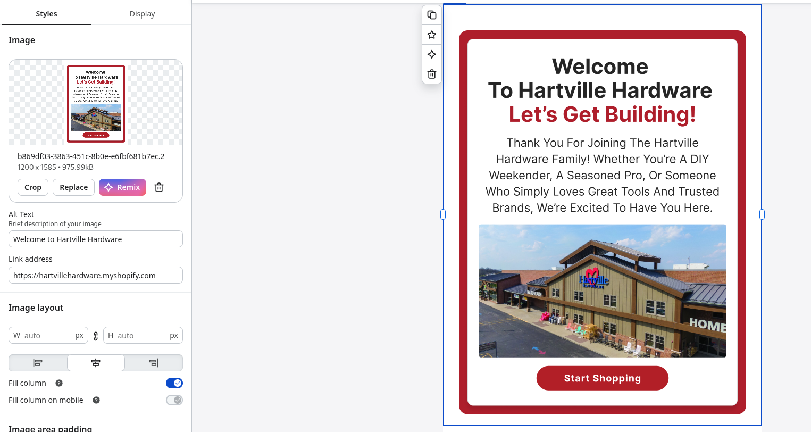

2. This is the link for second image:

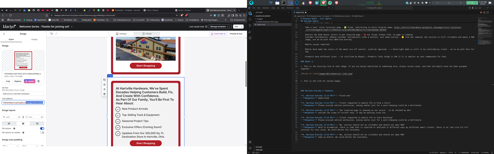

### Email 2:

3. Proof of link:
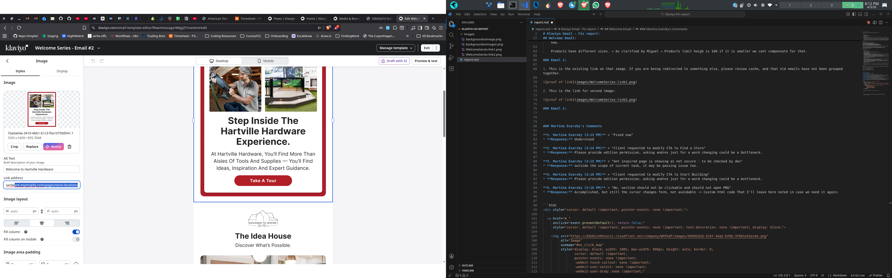

4. Proof of link 2:

Working fine; did you review a related theme of this store? That could mess up the link target.

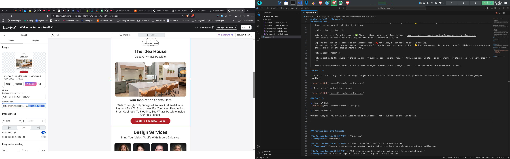


### Martina Esersky's Comments

**1. Martina Esersky (3:13 PM)** > "Fixed now"  
* **Response:** Understood

**2. Martina Esersky (3:14 PM)** > "Client requested to modify CTA to Find a Store"  
* **Response:** Please provide edition permission, asking andres just for a word changing could be a bottleneck.

**3. Martina Esersky (3:15 PM)** > "Get inspired page is showing as not secure - to be checked by dev"  
* **Response:** outside the scope of current task, it may be passing issue too.

**4. Martina Esersky (3:16 PM)** > "Client requested to modify CTA to Start Building"  
* **Response:** Please provide edition permission, asking andres just for a word changing could be a bottleneck.

**5. Martina Esersky (3:16 PM)** > "No, section should not be clickable and should not open PNG"  
* **Response:** Accomplished, but still the cursor changes form, not avoidable -> Custom html code That I'll leave here noted in case we need it again:


```html
<div style="cursor: default !important; pointer-events: none !important;">
  
  <a href="#_" 
     onclick="event.preventDefault(); return false;" 
     style="cursor: default !important; pointer-events: none !important; text-decoration: none !important; display: block;">
    
    
         
  </a>

  <map name="no_click_map" style="cursor: default !important;"></map>

</div>

```


**6. Martina Esersky (3:16 PM)** > "No, section should not be clickable and should not open PNG"  
* **Response:** Same as before.

## Abandoned Cart

    ❌ not working as expected ❌
    ❌  is being triggered even when the order is completed ❌
    first email do not contain “You may also like” section


    emails (all of them) table, do not bring all items left in the cart, but just one of them, and just shows the product line.


    Product images are clickable, and what they do is open a new tab with the image of the product.


    First email button redirects to product PDP.


    Second and Third emails button redirect to Cart, but not with the recovered cart products.


    First email links “cart” and “order” redirects to product PDP.


    Emails 2 and 3 are collapsing you may also like section when user received more than one email.


    Links redirection:
    The Hartville hardware team banner - redirecting to live site.
    Mobile issues:
    Proof: https://www.loom.com/share/f4614bd0986f48f58a4c42ed5aa43dbd
    Name of the product, quantity and price have different sizes thought the 3 emails.
    Name of the product is breaking too much lines.
    Missing you may also like section in first email
    Emails 2 and 3 are have you may also like section stacking the products (divergent with other emails that show them in 2 lines)
    Emails 2 and 3 are collapsing you may also like section and footer in two different parts when user received more than one email.

1. The email wait time was reduced to one minute so you can trigger it faster; if you did not complete the order in that time then is going to complete the flow. See point **3** for further explanation
2. *Emails 2 and 3 are collapsing you may also like section when user received more than one email.* Normal gmail behaviour. it collapses repetitive content and if you get the same email in less than 25 minutes it's going to collapse it. Klaviyo normally handles that.

* **Preview and Test Emails:** [How to preview and send test emails in Klaviyo](https://help.klaviyo.com/hc/en-us/articles/115005081907)
* **Deliverability Best Practices:** [Email deliverability best practices reference](https://help.klaviyo.com/hc/en-us/articles/25620771311643)
* **Gmail Clipping & Threading:** [Why is my email being clipped?](https://help.klaviyo.com/hc/en-us/articles/115000591251)
* **Spam & Preview Issues:** [Understanding why some preview emails go to spam](https://help.klaviyo.com/hc/en-us/articles/115005250468)


3. We can only show what comes on the events triggered by shopify, I'm attaching payload below so you can see that we do not get the line_items to loop through and show them. This events triggers **each time** something is added to the cart and we do not have a way to unify all events under the same session on klaviyo.


Payload:

```json
{"Product Type":""
"Price":40
"Quantity":1
"Client ID":"7cfccea0-b7d4-4d89-9a68-947b4ee847b8"
"VariantID":"44494969700488"
"OS":"Windows"
"ProductID":"8734846091400"
"Variant SKU":"1829774"
"Product Name":"Festool 578350 Granat D125 P150 GR Abrasives, 50-Pack"
"Variant Name":""
"Categories":[
0:"Abrasives"
1:"All Products"
2:"All products"
3:"Power Tool Accessories"
]
"Brand":"Festool"
"URL":"https://hartville-hardware-sandbox.myshopify.com/products/festool-578350-granat-d125-p150-gr-abrasives-50-pack"
"CompareAtPrice":0
"ImageURL":"https://cdn.shopify.com/s/files/1/0706/1844/8008/files/44ac869966146fe8e799eaa1b42d8cfbf636fa82_1829774_1_H.jpg?v=1772608641"
"_ip_country_code":"US"
"_ip_region_code":"OH"
"Browser":"Firefox"
"$currency":"USD"
"extra":{
"standard":{
"click_id":"Wrfdf1_KHtdcSKuXaa56erSC7-mNMW0WD56sTZKTa2UyXSk6V-BLtpbW9UKJYJ2h.WXFkdF"
"event_type":"product_added_to_cart"
"shop_id":70618448008
"limit_data_use":false
"customer_email_sha256":"df363b353d83d3f346ae8509285a5282de1934025d911b1f92396ca839508811"
"email_inferred":true
"click_id_inferred":true
"event_date_time":"2026-03-04T19:00:47Z"
}
}
"$value":40
}
```
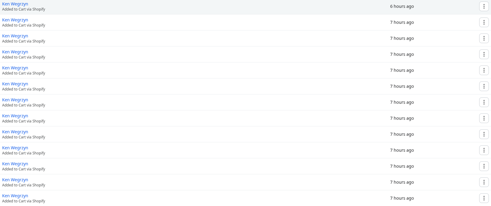

4. This flow has a policy of re-entry to avoid that you receive multiple of them each time; what happens is that for testing; if you need to do multiple runs, you may have an issue of not getting the email thats why is deactivated; I'll activate it again, if you have any issue let me know. Or review klaviyo's logs to see which emails (in profiles) have been skipped by flow restrictions.
5. Your cart is saved by shopify in a cookie; if you click the email and you are in a different session, you wont see the cart content as you left it.

## Abandoned Checkout:
6. About this comment: *I'm referring to text below the first image in the email, right below the header, they are all with "You're Just One Step Away" text, but this text should be only on first email, second and third have each a different message.* 

I think in this case you received the Abandoned Checkout; not the cart and you are right.

Abandoned Cart design:

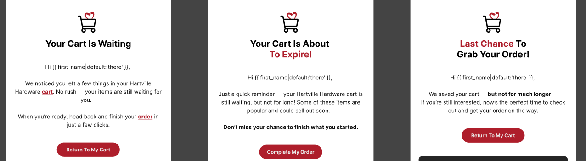

Abandoned Cart Emails: 

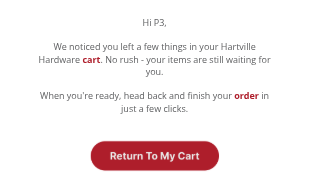
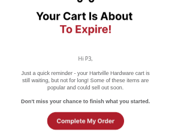
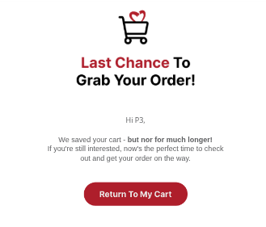

Also Abandoned Checkout just to show that it has been fixed:

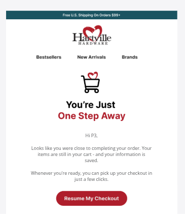
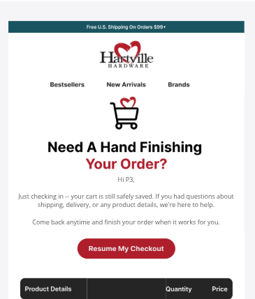
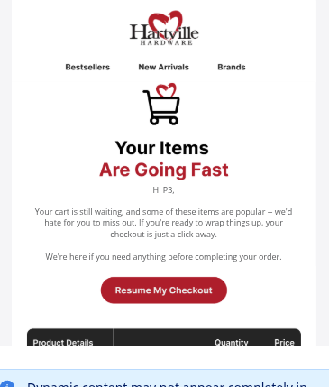

## Order Confirmation - shipping

    Order number only showing final 4 numbers, expected? —> as clarified by Martina → “Order numbers should be shown complete, not just last 4 numbers” - ❌ not fixed and a regression, Order number line is not showing up at the email.


    Also, “order” do not have an underline and it's not clickable, design suggests it should be a link. ❌


    Missing “,” after customer name. ❌


    Possible to interact and click with table elements and open png and download it. - ❌ not fixed


    The layout of the products table/summary is different from designs - 🟡 improved, but still off - @Martina Esersky are we ok with this?


    Showing SKU of the product below product name, is this expected? 🟡 @Martina Esersky please review. — this is not present on designs.


    the color of the products price is off, we’re using red for the final price, when red should only be used for promotional price. - ✅ fixed, normal price is showing as black.


    Not showing promotional price as red and strike out above final price. - ❌ not fixed, promotion price is not being show
    subtotal showing as red, should be black. - ✅ as expected, order confirmation email the subtotal is actually red, but this is a divergence from other emails received. 🟡 @Martina Esersky.


    not showing discount line on summary. - ❌ not fixed, discount line when there's a discounted/promotional item in the cart is not showing.


    Mobile issues:
    Mobile dark mode the colors of the email are off overall, could be improved. → Dark/light mode is still to be confirmed by client - we´re ok with this for now.


    Price is breaking a line in the table. - ✅ fixed.


    Address is clickable, open google maps and it’s blue. - ✅ fixed.


### Martina's comments:


1. Customer name has a comma after it.

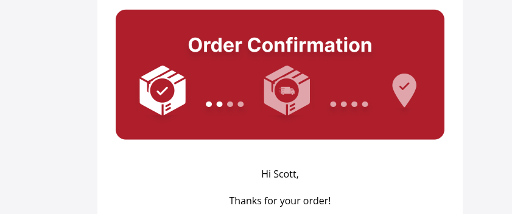

2. Let me know if "order" should be a link. We already have a button for it, so I'm confused about expected behaviour in no other place order is a link.
3. Interaction with png is impossible to fix; this is a behaviour that comes from google and also klaviyo does not give us the possibility to edit the code of the image in a dynamic table; the only fix is a full html section.
4. In a document sent by John (I think) they wanted to see the sku below the item.
5. About the discount, I reviewed orders made yesterday this is the code snippet:

```html

<div style="background-color: ; margin: -20px -20px; padding: 20px 15px; text-align: right; min-height: 60px; font-family: 'Open Sans', Helvetica, Arial, sans-serif;">
  
  
    
    <span style="display: block; line-height: 1.4; font-size: 11px; color: #757575; font-weight: 400; text-decoration: line-through; white-space: nowrap;">
      $&nbsp;{{ event.extra.line_items.0.compare_at_price|floatformat:'2' }}
    </span>
    
    <span style="display: block; line-height: 1.2; font-size: 14px; font-weight: 700; color: #ae1e2b; white-space: nowrap;">
      $&nbsp;{{ item.pre_tax_price|floatformat:'2' }}
    </span>

  
    
    <span style="display: block; line-height: 60px; font-size: 14px; font-weight: 700; color: #1d1e20; white-space: nowrap;">
      $&nbsp;{{ item.pre_tax_price|floatformat:'2' }}
    </span>

  

</div>

```

And this is that sections payload:

```json

"current_total_price_set":{
"shop_money":{
"amount":"44.52"
"currency_code":"USD"
}
"presentment_money":{
"amount":"44.52"
"currency_code":"USD"
}
}
"total_discounts_set":{
"shop_money":{
"amount":"0.00"
"currency_code":"USD"
}
"presentment_money":{
"amount":"0.00"
"currency_code":"USD"
}
}
"shipping_address":{
"address1":"23920 Katy Freeway"
"address2":NULL
"longitude":-95.787235
"city":"Katy"
"country_code":"US"
"name":"Shipx PthreeTesting"
"company":NULL
"province":"Texas"
"first_name":"Shipx"
"phone":NULL
"country":"United States"
"zip":"77494"
"latitude":29.7870006
"province_code":"TX"
"last_name":"PthreeTesting"
}

```

So we did not receive any kind of discount price. You can check it here: [Placed Order Metrics](https://www.klaviyo.com/metric/U8fChN/feed/placed-order) and look for the names used by thais for the orders. Also this is the reason we do not have a discount showing on the email.

6. Order confirmation has its subtotal in red; abandoned checkout and cart have subtotal in black.
7. Orders have ONLY four numbers now, we are not showing the last four, they have four. HWEBS is being excluded on the places it appears as this was asked by the client.
8. About the regression:

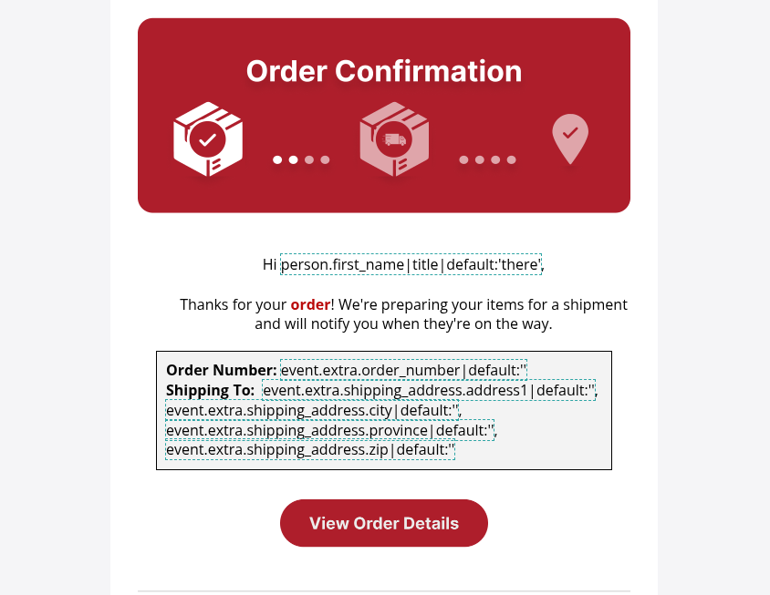

9. Price alignment: 

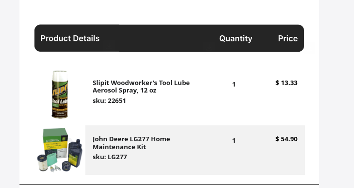

If you still feel it off, then we have a decision to make: Do we keep or not the zebra listing? This is because we have to use negative margins and almost 0 padding so there is no space between the cells and it looks like a single block, but in reality this are independent cells of a table row.


## Order Confirmation - Pick Up:


    Title of email: We've Got Your Order!
    Margin between image and customer greeting is small. ❌
    Missing “,” after customer name. ❌
    “order” do not have an underline and it's not clickable, design suggests it should be a link. ❌
    Showing “Order number” in the table, Pick up order confirmation email do not have Order number in the table. ❌
    Wrong fonts being used inside the table ❌
    “Hartville Hardware & Lumber” is not supposed to be bold. ❌
    also, my pickup for this order is in Middlefield, shouldn't this be different? @Martina Esersky please confirm. 🟡
    Missing phone and clock icons. ❌
    Phone is not red and underlined and has no action ❌
    View order details button redirecting to expected order details page. ✅
    Possible to interact and click with table elements and open png and download it, also with product images ❌
    table layout if off from designs, it was already improved, but still looking very different @Martina Esersky are we ok with this? 🟡
    Not showing promotional price as red and strike out above final price. ❌
    not showing discount line on summary when there's a discounted product. ❌
    Showing SKU of the product below product name, is this expected? 🟡 @Martina Esersky please review. — this is not present on designs.
    Mobile issues:
    Address is clickable, open google maps and it’s blue. ❌
    product not showing in mobile table. ❌
    also reproduces some listed issues from desktop, like, small margin, missing “,” after name, “order” not clickable… etc, please address all issues. ❌


1. Margin incremented.
2. Same as the other "order confirmation" is expected to be a link? we already have a button.
3. It should have the order number to mantain consistency between emails, formats and presentation of the information. Also, the order only has four numbers, here you have the payload: (Note: I was instructed to cut out the HWEBS part of the order.)
4. As stated before, in dynamic tables, image cell is protected so we cant do anything to change the png behaviour of some email clients.
5. By klaviyo's limitation, we cant be pixel perfect if we are using image assets.
6. Added some protection against that google reading of addresses, but cant be sure it works as it does not happen on my browser or my phone.

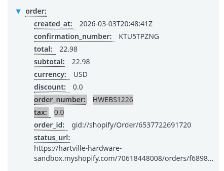

Mobile notes:
1. Address link is inyected by google, but I cant reproduce the issue on phone or desktop.
2. Fixed the table.

## Ready for Pick up:

    Title Email Ready for Pick Up: “Time to Pick Up Your Order”
    Title Email Picked up: “Your order has been Picked up!”
    Ready for pick up email
    has all issues reported at “Order Confirmation - PickUp.” ❌
    View PickUp details redirect to Order detail page, expected? 🟡 @Martina Esersky please confirm. link to proof: screencapture-mail-google-mail-u-0-2026-03-03-13_22_20.png
    Mobile Issues:
    Proof: File (4).png
    Address is clickable, open google maps and it’s blue. ❌
    Weird background on product table. ❌
    Product price being cut. ❌

    Picked up email:
    Unclear of the expectation, since figma shows “tracking number” and “Estimated delivery” but this is a picked up email, so it does not make sense. @Martina Esersky please review, below in proofs the email being sent is attached. 🟡🟡 link to proof: screencapture-mail-google-mail-u-0-2026-03-03-13_23_55.png
    Contact Us button redirecting to contact us page. ✅
    Mobile Issues:
    Proof: File (5).png
    Address is clickable, open google maps and it’s blue. ❌


1. Same responses as before.
2. I have this figma design:

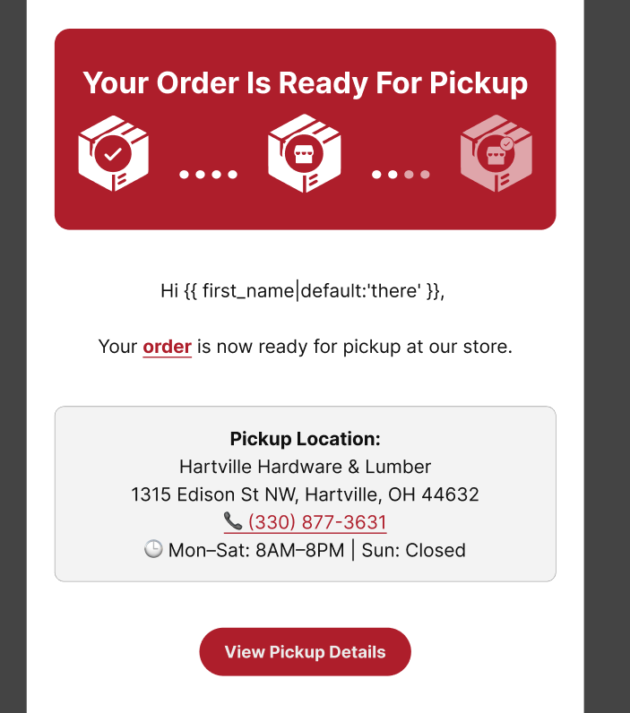

3. Added the comma too.
4. Fonts have been updated to have the same order that other emails have.


## Shipping Confirmation:

    “order” text is not clickable. ❌
    Missing “,” after customer name. ❌
    Estimated delivery not populated. 🟡 talked with Miguel and “that should be filled by the company; looks like I cant fake that.” maybe it's not an issue, but flagging to double check. cc: @Martina Esersky
    “Track my order” button don't have any action, and it's actually an PNG, when trying to click on it opens the button image. ❌
    Possible to interact and click with table elements and open png and download it. ❌
    table of products different from all other emails, values are different, showing USD, and missing subtotal, discount line, shipping… ❌
    Mobile issues:
    Proof: File (6).png
    Broken layout for table of info. ❌
    Weird background showing on products table. ❌
    Product prices being cut. ❌

1. Should order be clickable martina? we already have a button for it.
2. Comma added.
3. Carrier, Tracking Number,  are added on order fulfillment; based on documentation; estimated delivery should be added by carrier. I found a way to fake it on our testing script; but normally it should be filled by the carrier.
3. Track my order button wont have any actions because there is no link or url provided by the carrier.

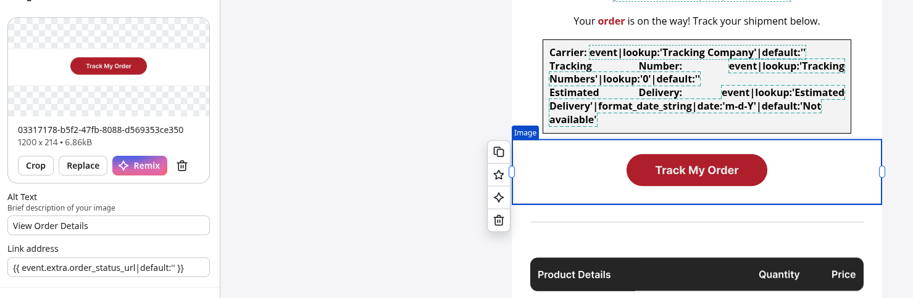


4. Dynamic Tables wont let us modify code around images.
5. This payload only contains order total. Discount, shipping, those are not present in the payload. Taxes exist, but as individual elements; trying to sum them could be problematic in a email template, so its better to just not use them. You can check the payload here: [Confirmed Shipment - Klaviyo](https://www.klaviyo.com/metric/RENM5h/feed/confirmed-shipment)
6. Need to create an order to test the *weird brackgorund*; I'll assume that is table/cell relate.

## Order Delivered

    “order” text is not clickable and missing underline. ❌
    Showing first four digits of order number after “order” text. ❌
    Missing “,” after customer name. ❌
    Contact Us button link is broken. ❌
    Mobile issues:
    Proof: File (8).png
    Broken layout for table of info. ❌

1. Same as before with order.
2. Same as before with order number.
3. Copy was changed and there is no name anymore. Need confirmation.
4. Link proof:

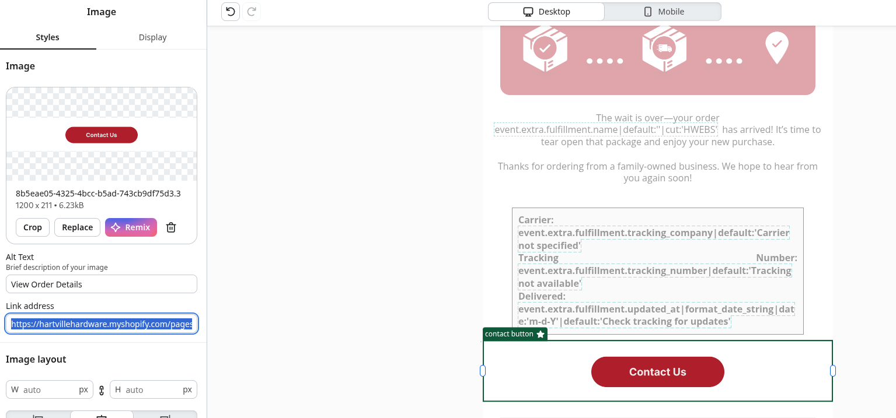

5. There is no table here.

## Order Canceled

    Order number only showing final 4 numbers - Not fixed ❌ - as clarified by Martina: “ • Order numbers should be shown complete, not just last 4 numbers”
    Phone number outlined in black (should be red) - ✅ fixed
    Phone number opening prompt to phone app in another tab. (should open in same tab). - ❌ not fixed.
    Mobile issues:
    Phone do not perform any action. - ❌ not fixed.
    Phone is underlined in white, should be red as well, like the email. - ✅ fixed


1. Same as before with order number. Not sure if you are expecting order's id, please clarify.

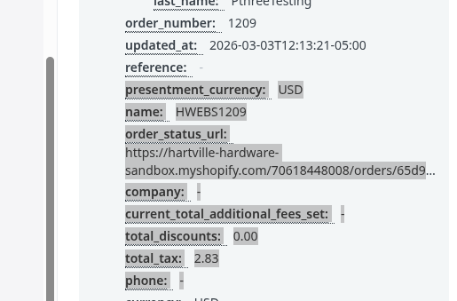


2. No issues with tel link on my end for mobile:

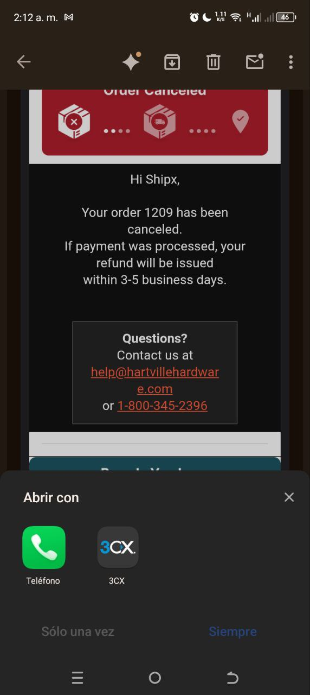

3. Phone number in a computer will open in a new tab. It may be klaviyo, it may be browser as it is looking for a phone app that may not exist on desktop. Should we delete the link for desktop and leave it only on mobile? I would say yes.


## Order Refunded:

    Order number only showing final 4 numbers - Not fixed ❌ - as clarified by Martina: “Order numbers should be shown complete, not just last 4 numbers”
    Verify payment method value, for a order paid with cards is saying “shopify_payments”. For a order paid in admin is saying “manual” - Not fixed ❌ - really weird to show customer “shopify_payments” @Martina Esersky please review, Miguel said in the ticket “- Payment method variables are handled by shopify's backend; we can only show what has been received.” 🟡🟡
    title says “being processed” but email says Processed. expected title? 🟡 @Martina Esersky please review.
    Mobile issues:
    Proof: File (9).png
    block with contents breaking too much line. ❌

1. Same as before with order.
2.  In shopify's payload for klaviyo, they have a variable called "payment_gateway_names", this is what we can show payment related. This variable is an array and can contain multiple values.
3. Reduced Padding on block for mobile, that should fix the breaking.

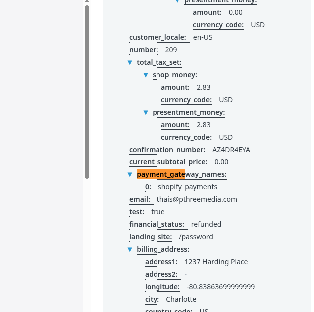


## Partial Refund:

    As per Martina: “Partial refund email mockup is the same as the refund email mockup”
    title says “we're processing your partial refund” but email says Refund Processed. expected title? 🟡 @Martina Esersky please review.
    Email not following mockup of refund email. ❌
    Please refer to the Refund email issues reported when fixing this one as well.

1. The real question is, should we remove item listing? thats the only difference, and I think its quite important to see what is being refunded.


## General Notes

